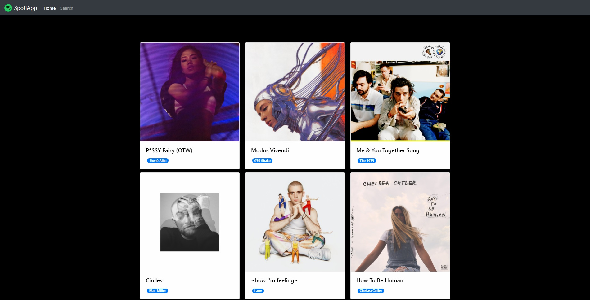
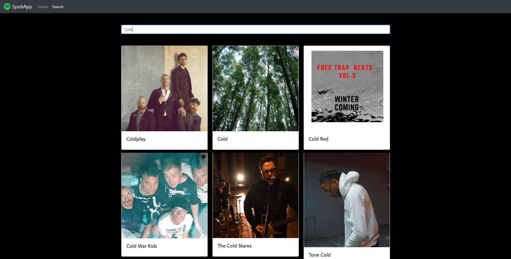
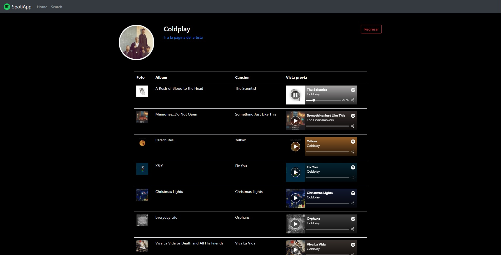
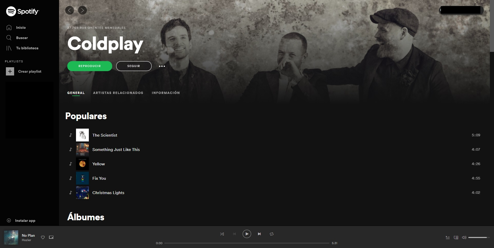

# Spotiapp

Realizada utilizando HTML5, CSS3 y JavaScript mediante el uso de Angular.
Ademas de consumir la API propia de Spotify para obtener distintos datos.

El unico problema de esta aplicación es que el token que se utiliza se tiene que cambiar cada cierto tiempo, porque dejan de andar los datos del API.

## Vistas

### Index
 

### Búsqueda
 

### Artista y con un mini reproductor de música
 

### Spotify del artista
En la pantalla del artista, propia de mi aplicación, abajo hay un link que al hacer click lleva a perfil del artista en cuestión, dentro de Spotify
 

## Uso:
Despues de descargar el repositorio, a traves de la linea de comando ejecutar el siguiente script:

*npm install*

y luego:

*ng serve" 
o

"ng serve -o*
